# Body sprite replacements (125)

[All sprite types](README.md)

Each preview shows frame index 6 of the sprite. Both images use the Nexus palette. The Baram column identifies the source frame used for the replacement. A single EPF frame can contain more than one visible shape.

| Nexus sprite / frame | Baram source sprite / frame | Original: frame 6 | Released: frame 6 |
| --- | --- | --- | --- |
| 0, frame 6 (body0.dat) | 0, frame 6 (C_Body0.dat) | 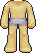 |  |
| 1, frame 86 (body0.dat) | 1, frame 109 (C_Body0.dat) | 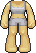 | 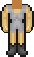 |
| 2, frame 166 (body0.dat) | 2, frame 212 (C_Body0.dat) | 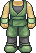 | 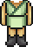 |
| 3, frame 246 (body0.dat) | 3, frame 315 (C_Body0.dat) | 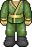 |  |
| 4, frame 326 (body0.dat) | 4, frame 418 (C_Body0.dat) | 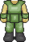 | 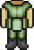 |
| 5, frame 406 (body0.dat) | 5, frame 521 (C_Body0.dat) | 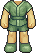 |  |
| 6, frame 486 (body0.dat) | 6, frame 624 (C_Body0.dat) | 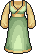 |  |
| 7, frame 566 (body0.dat) | 7, frame 727 (C_Body0.dat) | 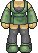 | 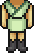 |
| 8, frame 646 (body0.dat) | 8, frame 830 (C_Body0.dat) | 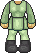 |  |
| 9, frame 726 (body0.dat) | 9, frame 933 (C_Body0.dat) | 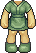 |  |
| 10, frame 806 (body0.dat) | 10, frame 1036 (C_Body0.dat) | 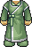 | 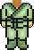 |
| 11, frame 886 (body0.dat) | 11, frame 1139 (C_Body0.dat) | 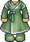 |  |
| 12, frame 966 (body0.dat) | 12, frame 1242 (C_Body0.dat) | 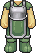 |  |
| 13, frame 1046 (body0.dat) | 13, frame 1345 (C_Body0.dat) | 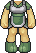 |  |
| 14, frame 1126 (body0.dat) | 14, frame 1448 (C_Body0.dat) | 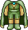 | 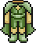 |
| 15, frame 1206 (body0.dat) | 15, frame 1551 (C_Body0.dat) |  |  |
| 16, frame 1286 (body0.dat) | 16, frame 1654 (C_Body0.dat) | 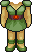 | 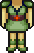 |
| 17, frame 1366 (body0.dat) | 17, frame 1757 (C_Body0.dat) |  |  |
| 18, frame 1446 (body0.dat) | 18, frame 1860 (C_Body0.dat) | 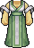 |  |
| 19, frame 1526 (body0.dat) | 19, frame 1963 (C_Body0.dat) |  |  |
| 20, frame 1606 (body0.dat) | 20, frame 2066 (C_Body0.dat) | 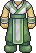 |  |
| 21, frame 1686 (body0.dat) | 21, frame 2169 (C_Body0.dat) |  |  |
| 22, frame 1766 (body0.dat) | 22, frame 2272 (C_Body0.dat) | 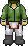 |  |
| 23, frame 1846 (body0.dat) | 23, frame 2375 (C_Body0.dat) | 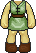 | 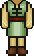 |
| 24, frame 1926 (body0.dat) | 24, frame 2478 (C_Body0.dat) | 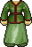 | 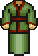 |
| 25, frame 2006 (body0.dat) | 25, frame 2581 (C_Body0.dat) | 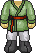 | 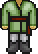 |
| 26, frame 2086 (body0.dat) | 26, frame 2684 (C_Body0.dat) |  |  |
| 27, frame 2166 (body0.dat) | 27, frame 2787 (C_Body0.dat) | 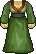 |  |
| 28, frame 2246 (body0.dat) | 28, frame 2890 (C_Body0.dat) |  |  |
| 29, frame 2326 (body0.dat) | 29, frame 2993 (C_Body0.dat) |  | 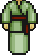 |
| 30, frame 2406 (body0.dat) | 30, frame 3096 (C_Body0.dat) | 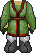 |  |
| 31, frame 2486 (body0.dat) | 31, frame 3199 (C_Body0.dat) | 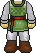 |  |
| 32, frame 2566 (body0.dat) | 32, frame 3302 (C_Body0.dat) | 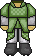 | 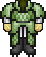 |
| 33, frame 2646 (body1.dat) | 33, frame 3405 (C_Body0.dat) | 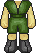 |  |
| 34, frame 2726 (body1.dat) | 34, frame 3508 (C_Body0.dat) | 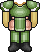 | 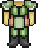 |
| 35, frame 2806 (body1.dat) | 35, frame 3611 (C_Body0.dat) | 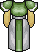 |  |
| 36, frame 2886 (body1.dat) | 36, frame 3714 (C_Body0.dat) | 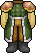 | 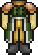 |
| 37, frame 2966 (body1.dat) | 37, frame 3817 (C_Body0.dat) | 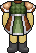 |  |
| 38, frame 3046 (body1.dat) | 38, frame 3920 (C_Body0.dat) | 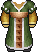 |  |
| 39, frame 3126 (body1.dat) | 39, frame 4023 (C_Body0.dat) | 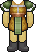 | 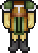 |
| 40, frame 3206 (body1.dat) | 40, frame 4126 (C_Body0.dat) | 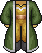 | 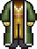 |
| 41, frame 3286 (body1.dat) | 41, frame 4229 (C_Body0.dat) |  |  |
| 42, frame 3366 (body1.dat) | 42, frame 4332 (C_Body0.dat) |  |  |
| 43, frame 3446 (body1.dat) | 43, frame 4435 (C_Body0.dat) |  |  |
| 44, frame 3526 (body1.dat) | 44, frame 4538 (C_Body0.dat) |  |  |
| 45, frame 3606 (body1.dat) | 45, frame 4641 (C_Body0.dat) |  |  |
| 46, frame 3686 (body1.dat) | 46, frame 4744 (C_Body0.dat) |  |  |
| 47, frame 3766 (body1.dat) | 47, frame 4847 (C_Body0.dat) |  |  |
| 48, frame 3846 (body1.dat) | 48, frame 4950 (C_Body0.dat) |  |  |
| 49, frame 3926 (body1.dat) | 49, frame 5053 (C_Body0.dat) |  |  |
| 50, frame 4006 (body1.dat) | 50, frame 5156 (C_Body0.dat) |  |  |
| 51, frame 4086 (body1.dat) | 51, frame 5259 (C_Body0.dat) |  |  |
| 52, frame 4166 (body1.dat) | 52, frame 5362 (C_Body0.dat) |  |  |
| 53, frame 4246 (body1.dat) | 53, frame 5465 (C_Body0.dat) |  |  |
| 54, frame 4326 (body1.dat) | 54, frame 5568 (C_Body0.dat) |  |  |
| 55, frame 4406 (body1.dat) | 55, frame 5671 (C_Body0.dat) |  |  |
| 56, frame 4486 (body1.dat) | 56, frame 5774 (C_Body0.dat) |  |  |
| 57, frame 4566 (body1.dat) | 57, frame 5877 (C_Body0.dat) |  |  |
| 58, frame 4646 (body1.dat) | 58, frame 5980 (C_Body0.dat) |  |  |
| 59, frame 4726 (body1.dat) | 59, frame 6083 (C_Body0.dat) |  |  |
| 60, frame 4806 (body1.dat) | 60, frame 6186 (C_Body0.dat) |  |  |
| 61, frame 4886 (body1.dat) | 61, frame 6289 (C_Body0.dat) |  |  |
| 62, frame 4966 (body1.dat) | 62, frame 6392 (C_Body0.dat) |  |  |
| 63, frame 5046 (body1.dat) | 63, frame 6495 (C_Body0.dat) |  |  |
| 64, frame 5126 (body1.dat) | 64, frame 6598 (C_Body0.dat) |  |  |
| 65, frame 5206 (body2.dat) | 65, frame 6701 (C_Body0.dat) |  |  |
| 66, frame 5286 (body2.dat) | 66, frame 6804 (C_Body0.dat) |  |  |
| 67, frame 5366 (body2.dat) | 67, frame 6907 (C_Body0.dat) |  |  |
| 68, frame 5446 (body2.dat) | 68, frame 7010 (C_Body0.dat) |  |  |
| 69, frame 5526 (body2.dat) | 69, frame 7113 (C_Body0.dat) |  |  |
| 70, frame 5606 (body2.dat) | 70, frame 7216 (C_Body0.dat) |  |  |
| 71, frame 5686 (body2.dat) | 71, frame 7319 (C_Body0.dat) |  |  |
| 72, frame 5766 (body2.dat) | 72, frame 7422 (C_Body0.dat) |  |  |
| 73, frame 5846 (body2.dat) | 73, frame 7525 (C_Body0.dat) |  |  |
| 74, frame 5926 (body2.dat) | 74, frame 7628 (C_Body0.dat) |  |  |
| 75, frame 6006 (body2.dat) | 75, frame 7731 (C_Body0.dat) |  |  |
| 76, frame 6086 (body2.dat) | 76, frame 7834 (C_Body0.dat) |  |  |
| 77, frame 6166 (body2.dat) | 77, frame 7937 (C_Body0.dat) |  |  |
| 78, frame 6246 (body2.dat) | 78, frame 8040 (C_Body0.dat) |  |  |
| 79, frame 6326 (body2.dat) | 79, frame 8143 (C_Body0.dat) |  |  |
| 80, frame 6406 (body2.dat) | 80, frame 8246 (C_Body0.dat) |  |  |
| 81, frame 6486 (body2.dat) | 81, frame 8349 (C_Body0.dat) |  |  |
| 82, frame 6566 (body2.dat) | 82, frame 8452 (C_Body0.dat) |  |  |
| 83, frame 6646 (body2.dat) | 83, frame 8555 (C_Body0.dat) |  |  |
| 84, frame 6726 (body2.dat) | 84, frame 8658 (C_Body0.dat) |  |  |
| 85, frame 6806 (body2.dat) | 85, frame 8761 (C_Body1.dat) |  |  |
| 86, frame 6886 (body2.dat) | 86, frame 8864 (C_Body1.dat) |  |  |
| 87, frame 6966 (body2.dat) | 87, frame 8967 (C_Body1.dat) |  |  |
| 88, frame 7046 (body2.dat) | 88, frame 9070 (C_Body1.dat) |  |  |
| 89, frame 7126 (body2.dat) | 89, frame 9173 (C_Body1.dat) |  |  |
| 90, frame 7206 (body2.dat) | 90, frame 9276 (C_Body1.dat) |  |  |
| 91, frame 7286 (body2.dat) | 91, frame 9379 (C_Body1.dat) |  |  |
| 92, frame 7366 (body2.dat) | 92, frame 9482 (C_Body1.dat) |  |  |
| 93, frame 7446 (body2.dat) | 93, frame 9585 (C_Body1.dat) |  |  |
| 94, frame 7526 (body2.dat) | 94, frame 9688 (C_Body1.dat) |  |  |
| 95, frame 7606 (body2.dat) | 95, frame 9791 (C_Body1.dat) |  |  |
| 96, frame 7686 (body2.dat) | 96, frame 9894 (C_Body1.dat) |  |  |
| 97, frame 7766 (body2.dat) | 97, frame 9997 (C_Body1.dat) |  |  |
| 98, frame 7846 (body3.dat) | 98, frame 10100 (C_Body1.dat) |  |  |
| 99, frame 7926 (body3.dat) | 99, frame 10203 (C_Body1.dat) |  |  |
| 100, frame 8006 (body3.dat) | 100, frame 10306 (C_Body1.dat) |  |  |
| 101, frame 8086 (body3.dat) | 101, frame 10409 (C_Body1.dat) |  |  |
| 102, frame 8166 (body3.dat) | 102, frame 10512 (C_Body1.dat) |  |  |
| 103, frame 8246 (body3.dat) | 103, frame 10615 (C_Body1.dat) |  |  |
| 104, frame 8326 (body3.dat) | 104, frame 10718 (C_Body1.dat) |  |  |
| 105, frame 8406 (body3.dat) | 105, frame 10821 (C_Body1.dat) |  |  |
| 106, frame 8486 (body3.dat) | 106, frame 10924 (C_Body1.dat) |  |  |
| 107, frame 8566 (body3.dat) | 107, frame 11027 (C_Body1.dat) |  |  |
| 108, frame 8646 (body3.dat) | 108, frame 11130 (C_Body1.dat) |  |  |
| 109, frame 8726 (body3.dat) | 109, frame 11233 (C_Body1.dat) |  |  |
| 110, frame 8806 (body3.dat) | 110, frame 11336 (C_Body1.dat) |  |  |
| 111, frame 8886 (body3.dat) | 111, frame 11439 (C_Body1.dat) |  |  |
| 112, frame 8966 (body3.dat) | 112, frame 11542 (C_Body1.dat) |  |  |
| 113, frame 9046 (body3.dat) | 113, frame 11645 (C_Body1.dat) |  |  |
| 114, frame 9126 (body3.dat) | 114, frame 11748 (C_Body1.dat) |  |  |
| 115, frame 9206 (body3.dat) | 115, frame 11851 (C_Body1.dat) |  |  |
| 116, frame 9286 (body3.dat) | 116, frame 11954 (C_Body1.dat) |  |  |
| 117, frame 9366 (body3.dat) | 117, frame 12057 (C_Body1.dat) |  |  |
| 118, frame 9446 (body3.dat) | 118, frame 12160 (C_Body1.dat) |  |  |
| 119, frame 9526 (body3.dat) | 119, frame 12263 (C_Body1.dat) |  |  |
| 120, frame 9606 (body3.dat) | 120, frame 12366 (C_Body1.dat) |  |  |
| 121, frame 9686 (body3.dat) | 121, frame 12469 (C_Body1.dat) |  |  |
| 122, frame 9766 (body3.dat) | 122, frame 12572 (C_Body1.dat) |  |  |
| 123, frame 9846 (body3.dat) | 123, frame 12675 (C_Body1.dat) |  |  |
| 124, frame 9926 (body3.dat) | 124, frame 12778 (C_Body1.dat) |  |  |

