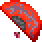

# Fan sprite replacements (6)

[All sprite types](README.md)

Each preview shows frame index 6 of the sprite. Both images use the Nexus palette. The Baram column identifies the source frame used for the replacement. A single EPF frame can contain more than one visible shape.

| Nexus sprite / frame | Baram source sprite / frame | Original: frame 6 | Released: frame 6 |
| --- | --- | --- | --- |
| 0, frame 6 (fan0.dat) | 0, frame 6 (C_Fan0.dat) |  |  |
| 1, frame 26 (fan0.dat) | 1, frame 26 (C_Fan0.dat) |  |  |
| 2, frame 46 (fan0.dat) | 2, frame 46 (C_Fan0.dat) |  |  |
| 3, frame 66 (fan0.dat) | 3, frame 66 (C_Fan0.dat) |  |  |
| 4, frame 86 (fan0.dat) | 4, frame 86 (C_Fan0.dat) |  |  |
| 5, frame 106 (fan0.dat) | 5, frame 106 (C_Fan0.dat) |  |  |

