# Riding ID 0 frame comparison

[Mapping summary](../README.md)

Baram C_Riding0.epf uses C_Riding.pal index 167. Nexus RIDINGS.EPF uses RIDINGS.PAL index 2 for riding ID 0.

| Frame | Classic source | Nexus target |
| ---: | --- | --- |
| 0 | 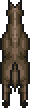 | 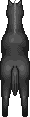 |
| 1 | 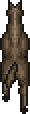 | 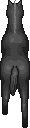 |
| 2 | 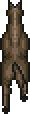 | 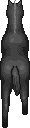 |
| 3 | 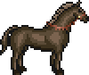 | 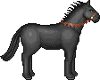 |
| 4 | 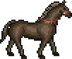 | 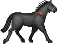 |
| 5 | 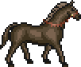 | 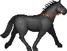 |
| 6 | 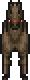 | 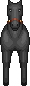 |
| 7 | 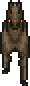 | 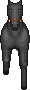 |
| 8 | 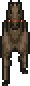 | 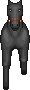 |
| 9 | 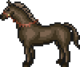 | 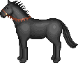 |
| 10 | 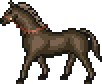 | 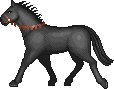 |
| 11 | 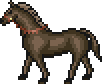 | 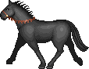 |
