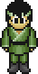
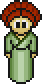
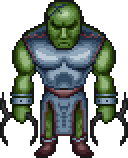
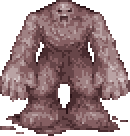
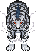
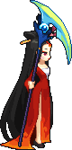

# Mobs to check in the client

These are frame **06** previews from the current `Release/` files, with the released palette. Use the picture to recognize each mob in game. The IDs are included only as references to the data files.

For each one you can encounter, check that its colors look right and that turning, walking, attacking, being hit, and dying use the expected poses. The first four show changed classic animations; the last two check that later Nexus mobs still work.

## Small green creature with yellow horns

**Why check it:** Its classic version has a full animation where the original Nexus entry had a single frame.

**What to watch:** Watch it turn, walk, attack, react to a hit, and die.

Data reference
Monster ID 2; released global frame 56; mon0.dat.

## Pale robed figure with an orange headdress

**Why check it:** Its classic frame count and animation layout differ from the original.

**What to watch:** Watch movement and combat from more than one direction.

Data reference
Monster ID 14; released global frame 200; mon0.dat.

## Large green armored creature

**Why check it:** Its frame count and animation layout differ slightly from the original.

**What to watch:** Check for a missing frame, a sudden jump, or an incorrect pose during movement and combat.

Data reference
Monster ID 500; released global frame 10968; mon20.dat.

## Shaggy pink beast

**Why check it:** This is the final monster replaced by the classic set.

**What to watch:** Confirm it animates normally; it checks the end of the classic frame range.

Data reference
Monster ID 734; released global frame 14461; mon29.dat.

## White tiger

**Why check it:** This is the first monster after the classic replacements.

**What to watch:** Confirm it still appears and animates normally after its frame data was shifted.

Data reference
Monster ID 735; released global frame 14490; mon29.dat.

## Red robed figure with a blue crescent blade

**Why check it:** This is the last monster in the Nexus metadata.

**What to watch:** Confirm it still appears and animates normally; it checks the far end of the shifted frame range.

Data reference
Monster ID 2012; released global frame 48792; mon67.dat.

If a creature never appears in your usual areas, skip it. You can choose another recognizable mob from the [visual comparison pages](tmp/mapping-validation/monsters/README.md) after running `npm run validate-mappings`. The main goal is to see changed classic animations and at least one preserved Nexus monster.
