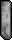

# Shield sprite replacements (25)

[All sprite types](README.md)

Each preview shows frame index 6 of the sprite. Both images use the Nexus palette. The Baram column identifies the source frame used for the replacement. A single EPF frame can contain more than one visible shape.

| Nexus sprite / frame | Baram source sprite / frame | Original: frame 6 | Released: frame 6 |
| --- | --- | --- | --- |
| 0, frame 6 (shield0.dat) | 0, frame 6 (C_Shield0.dat) |  |  |
| 1, frame 26 (shield0.dat) | 1, frame 26 (C_Shield0.dat) |  |  |
| 2, frame 46 (shield0.dat) | 2, frame 46 (C_Shield0.dat) |  |  |
| 3, frame 66 (shield0.dat) | 3, frame 66 (C_Shield0.dat) |  |  |
| 4, frame 86 (shield0.dat) | 4, frame 86 (C_Shield0.dat) |  |  |
| 5, frame 106 (shield0.dat) | 5, frame 106 (C_Shield0.dat) |  |  |
| 6, frame 126 (shield0.dat) | 6, frame 126 (C_Shield0.dat) |  |  |
| 7, frame 146 (shield0.dat) | 7, frame 146 (C_Shield0.dat) |  |  |
| 8, frame 166 (shield0.dat) | 8, frame 166 (C_Shield0.dat) |  |  |
| 9, frame 186 (shield0.dat) | 9, frame 186 (C_Shield0.dat) |  |  |
| 10, frame 206 (shield0.dat) | 10, frame 206 (C_Shield0.dat) |  |  |
| 11, frame 226 (shield0.dat) | 11, frame 226 (C_Shield0.dat) |  |  |
| 12, frame 246 (shield0.dat) | 12, frame 246 (C_Shield0.dat) |  |  |
| 13, frame 266 (shield0.dat) | 13, frame 266 (C_Shield0.dat) |  |  |
| 14, frame 286 (shield0.dat) | 14, frame 286 (C_Shield0.dat) |  |  |
| 15, frame 306 (shield0.dat) | 15, frame 306 (C_Shield0.dat) |  |  |
| 16, frame 326 (shield0.dat) | 16, frame 326 (C_Shield0.dat) |  |  |
| 17, frame 346 (shield0.dat) | 17, frame 346 (C_Shield0.dat) |  |  |
| 18, frame 366 (shield0.dat) | 18, frame 366 (C_Shield0.dat) |  |  |
| 19, frame 386 (shield0.dat) | 19, frame 386 (C_Shield0.dat) |  |  |
| 20, frame 406 (shield0.dat) | 20, frame 406 (C_Shield0.dat) |  |  |
| 21, frame 426 (shield0.dat) | 21, frame 426 (C_Shield0.dat) |  |  |
| 22, frame 446 (shield0.dat) | 22, frame 446 (C_Shield0.dat) |  |  |
| 23, frame 466 (shield0.dat) | 23, frame 466 (C_Shield0.dat) |  |  |
| 24, frame 486 (shield0.dat) | 24, frame 486 (C_Shield0.dat) |  |  |

