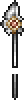

# Spear sprite replacements (49)

[All sprite types](README.md)

Each preview shows frame index 6 of the sprite. Both images use the Nexus palette. The Baram column identifies the source frame used for the replacement. A single EPF frame can contain more than one visible shape.

| Nexus sprite / frame | Baram source sprite / frame | Original: frame 6 | Released: frame 6 |
| --- | --- | --- | --- |
| 0, frame 6 (spear0.dat) | 0, frame 6 (C_Spear0.dat) |  |  |
| 1, frame 26 (spear0.dat) | 1, frame 26 (C_Spear0.dat) |  |  |
| 2, frame 46 (spear0.dat) | 2, frame 46 (C_Spear0.dat) |  |  |
| 3, frame 66 (spear0.dat) | 3, frame 66 (C_Spear0.dat) |  |  |
| 4, frame 86 (spear0.dat) | 4, frame 86 (C_Spear0.dat) |  |  |
| 5, frame 106 (spear0.dat) | 5, frame 106 (C_Spear0.dat) |  |  |
| 6, frame 126 (spear0.dat) | 6, frame 126 (C_Spear0.dat) |  |  |
| 7, frame 146 (spear0.dat) | 7, frame 146 (C_Spear0.dat) |  |  |
| 8, frame 166 (spear0.dat) | 8, frame 166 (C_Spear0.dat) |  |  |
| 9, frame 186 (spear0.dat) | 9, frame 186 (C_Spear0.dat) |  |  |
| 10, frame 206 (spear0.dat) | 10, frame 206 (C_Spear0.dat) |  |  |
| 11, frame 226 (spear0.dat) | 11, frame 226 (C_Spear0.dat) |  |  |
| 12, frame 246 (spear0.dat) | 12, frame 246 (C_Spear0.dat) |  |  |
| 13, frame 266 (spear0.dat) | 13, frame 266 (C_Spear0.dat) |  |  |
| 14, frame 286 (spear0.dat) | 14, frame 286 (C_Spear0.dat) |  |  |
| 15, frame 306 (spear0.dat) | 15, frame 306 (C_Spear0.dat) |  |  |
| 16, frame 326 (spear0.dat) | 16, frame 326 (C_Spear0.dat) |  |  |
| 17, frame 346 (spear0.dat) | 17, frame 346 (C_Spear0.dat) |  |  |
| 18, frame 366 (spear0.dat) | 18, frame 366 (C_Spear0.dat) |  |  |
| 19, frame 386 (spear0.dat) | 19, frame 386 (C_Spear0.dat) |  |  |
| 20, frame 406 (spear0.dat) | 20, frame 406 (C_Spear0.dat) |  |  |
| 21, frame 426 (spear0.dat) | 21, frame 426 (C_Spear0.dat) |  |  |
| 22, frame 446 (spear0.dat) | 22, frame 446 (C_Spear0.dat) |  |  |
| 23, frame 466 (spear0.dat) | 23, frame 466 (C_Spear0.dat) |  |  |
| 24, frame 486 (spear0.dat) | 24, frame 486 (C_Spear0.dat) |  |  |
| 25, frame 506 (spear0.dat) | 25, frame 506 (C_Spear0.dat) |  |  |
| 26, frame 526 (spear0.dat) | 26, frame 526 (C_Spear0.dat) |  |  |
| 27, frame 546 (spear0.dat) | 27, frame 546 (C_Spear0.dat) |  |  |
| 28, frame 566 (spear0.dat) | 28, frame 566 (C_Spear0.dat) |  |  |
| 29, frame 586 (spear0.dat) | 29, frame 586 (C_Spear0.dat) |  |  |
| 30, frame 606 (spear0.dat) | 30, frame 606 (C_Spear0.dat) |  |  |
| 31, frame 626 (spear0.dat) | 31, frame 626 (C_Spear0.dat) |  |  |
| 32, frame 646 (spear0.dat) | 32, frame 646 (C_Spear0.dat) |  |  |
| 33, frame 666 (spear0.dat) | 33, frame 666 (C_Spear0.dat) |  |  |
| 34, frame 686 (spear0.dat) | 34, frame 686 (C_Spear0.dat) |  |  |
| 35, frame 706 (spear0.dat) | 35, frame 706 (C_Spear0.dat) |  |  |
| 36, frame 726 (spear0.dat) | 36, frame 726 (C_Spear0.dat) |  |  |
| 37, frame 746 (spear0.dat) | 37, frame 746 (C_Spear0.dat) |  |  |
| 38, frame 766 (spear0.dat) | 38, frame 766 (C_Spear0.dat) |  |  |
| 39, frame 786 (spear0.dat) | 39, frame 786 (C_Spear0.dat) |  |  |
| 40, frame 806 (spear0.dat) | 40, frame 806 (C_Spear0.dat) |  |  |
| 41, frame 826 (spear0.dat) | 41, frame 826 (C_Spear0.dat) |  |  |
| 42, frame 846 (spear0.dat) | 42, frame 846 (C_Spear0.dat) |  |  |
| 43, frame 866 (spear0.dat) | 43, frame 866 (C_Spear0.dat) |  |  |
| 44, frame 886 (spear0.dat) | 44, frame 886 (C_Spear0.dat) |  |  |
| 45, frame 906 (spear0.dat) | 45, frame 906 (C_Spear0.dat) |  |  |
| 46, frame 926 (spear0.dat) | 46, frame 926 (C_Spear0.dat) |  |  |
| 47, frame 946 (spear0.dat) | 47, frame 946 (C_Spear0.dat) |  |  |
| 48, frame 966 (spear0.dat) | 48, frame 966 (C_Spear0.dat) |  |  |

